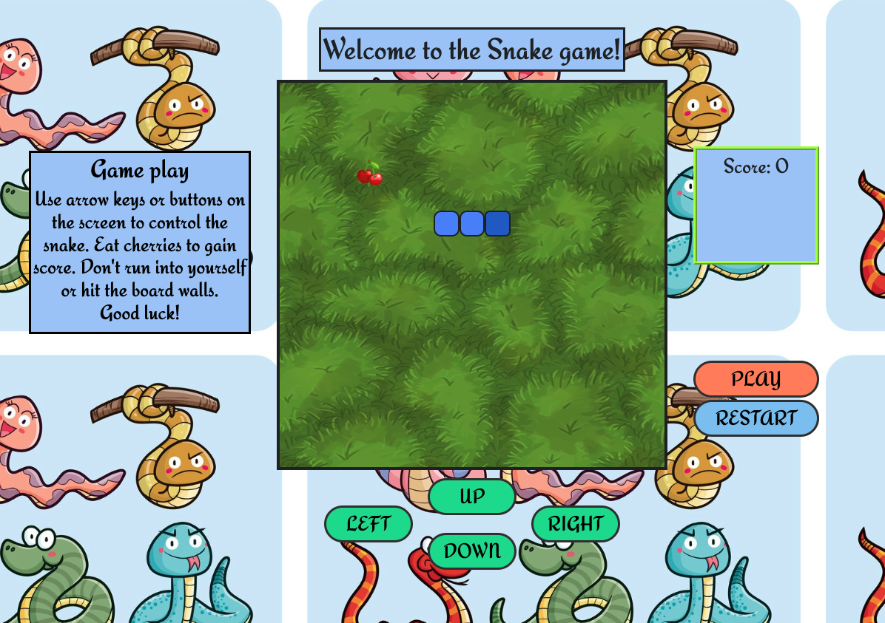
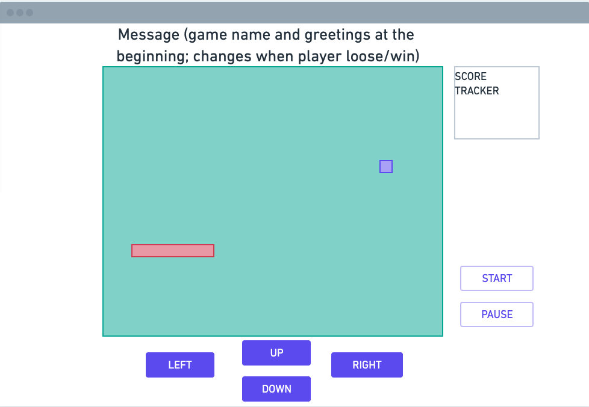

# Snake

A good old classic Snake game with a bit of a personal design. Crawl around, eat delicious cherries, and try not to hit yourself or the board walls. Or... just crawl around! Who said you can’t make your own rules?(Watch out for the walls, though) Of course, have fun!

## Getting Started

Try the game now: <https://illia-br.github.io/snake-game/>

## Screenshots

## Technologies used

+ HTML
+ JavaScript
+ CSS

## Planned future enhancements

+ Improve responsive design
+ Add a Light/Dark Mode
+ Store previous scores on the player's machine using *localStorage*
+ Graphic enhancements: make the snake look like a snake
